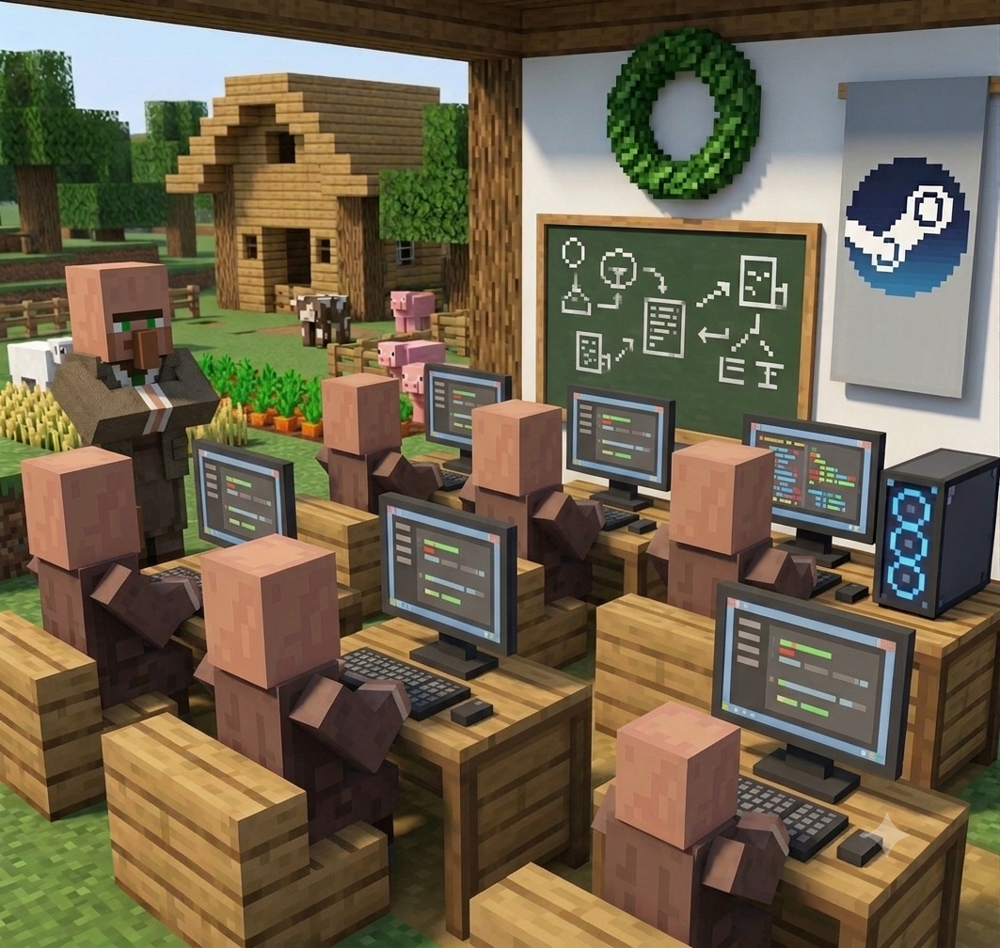

# Warming up accounts

<figure><figcaption></figcaption></figure>


**My honest opinion:** the topic of warming up is still debatable. I've seen empty accounts calmly survive waves, and I've seen nicely warmed-up ones fall first. Nobody has any guarantees here, no matter what they sell you.

But there is logic to warming up. In public modes, live players see the account and reports fly at it — there a profile's "humanity" works. In closed modes, where your accounts play among themselves, the effect is much weaker.


<h2 align="center">🆓 <mark style="color:green;">Free warming up</mark></h2>

#### Done through [**ASF**](../programmy/asf.md) — you rack up hours in free games and collect trading cards along the way, if they're available.

### <mark style="color:blue;">How it works</mark>

#### **Launching bots.** In the ASF web interface you see a list of accounts that have `.json` configs created. The toggle next to a name launches the bot.


**Recommendation:** don't launch more than 50 accounts at a time. You can bring everything up with a single `start asf` command, but only do that if fewer than fifty are loaded — otherwise both the system and the connection will choke.


#### **Runtime.** An hour, two, a day — up to you. The main thing is not to close the ASF console and the web interface tab. The program runs in the background, and you can use the computer while it does.

#### **Stopping.** Either with the same toggle in the interface, or with the `stop asf` command in the "Commands" tab. After stopping a batch, you launch the next one.

<h2 align="center">💳 <mark style="color:green;">Paid warming up</mark></h2>

### <mark style="color:blue;">1. Buying games with cards</mark>

#### The point is that you're not just warming up the account, you're also earning. Cheap discounted games whose cards cost more than the game itself pay for themselves.


**Card farming only works on accounts without the $5 limit.** On a limited account cards don't drop at all — remove the restriction first.


### <mark style="color:blue;">How to find profitable games</mark>

1. #### Go to the Steam store, apply the "Trading Cards" filter.
2. #### Sort from cheap to expensive, look at games with a 70–90% discount.
3. #### Copy the game's name and search for its cards on the marketplace.
4. #### Calculate: the number of cards that can drop, multiplied by the average price, minus the Steam fee.
5. #### If it comes out noticeably higher than the game's price — buy it.

#### **Example of the logic.** A game costs a hypothetical $4. The collection has 5 cards, the average price is 3 units, and at most 3 can drop. That's ~9 before the fee, ~7.7 after. The game pays for itself almost twice over — buy it. Even in the worst case you don't go into the red.


Once you've gathered 20 such games — buy them onto every account. Repeat the search once a week: discounts change, new options appear. Watch especially for the summer and winter sales — there are dozens of such games then.


### <mark style="color:blue;">2. Activity in other games</mark>

#### Most panels added an activity booster long ago, so there's not much need to bother by hand. But if you want to do it manually: add a couple of free games to the library and run them for a few hours. The account starts to look alive.

### <mark style="color:blue;">3. Game keys</mark>

#### Keys for games with cards can be bought on dedicated sites and in giveaways. It often comes out cheaper than buying on Steam directly. Check the platform's reputation before buying a large batch.
