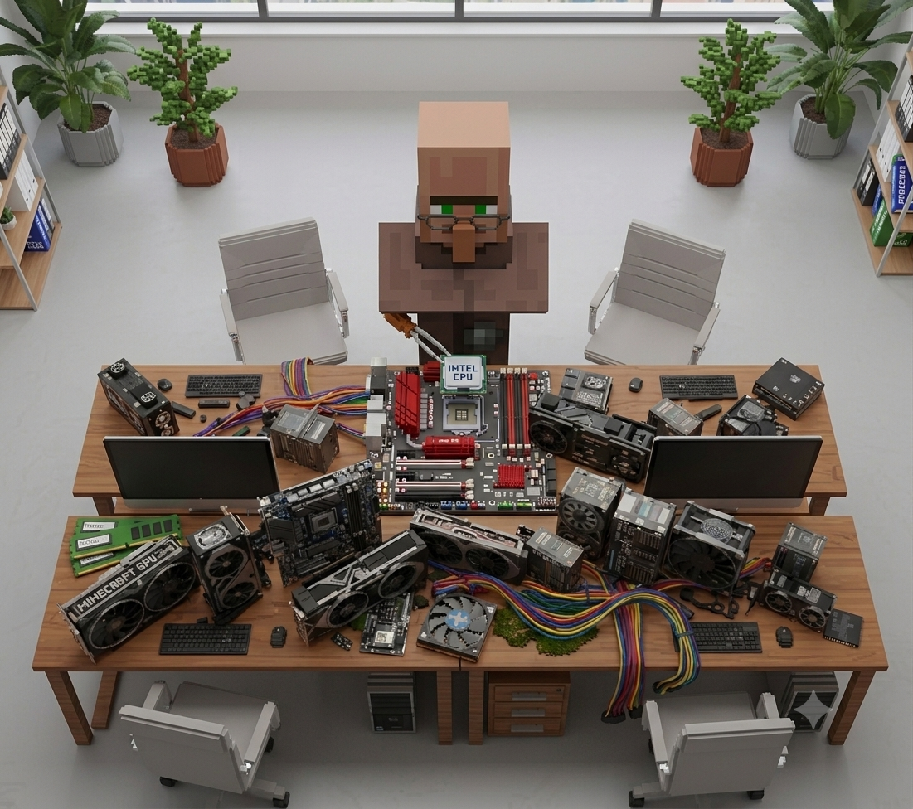

# Minimum / Recommended builds

<figure><figcaption></figcaption></figure>


**What is a "stream"?** It's one batch of accounts the machine cycles through in a week. One stream ≈ 160 accounts, two streams ≈ 320. The numbers are approximate and depend on the mode and the panel.


<h2 align="center">⚠️ <mark style="color:green;">Minimum requirements</mark></h2>

### <mark style="color:blue;">One stream of 2v2 farming (≈160 accounts per week)</mark>

* #### **CPU** — Intel Core i5-10400F / AMD Ryzen 5 2600 / Xeon E5-2680 v3
* #### **RAM** — 16 GB
* #### **SSD** — 50 GB free space for the pagefile
* #### **GPU** — GeForce GT 1030 DDR5

### <mark style="color:blue;">Two streams of 2v2 farming (≈320 accounts per week)</mark>

* #### **CPU** — Intel Core i5-12400F / AMD Ryzen 5 5600X / Xeon E5-2696 v3
* #### **RAM** — 32 GB
* #### **SSD** — 80 GB free space for the pagefile
* #### **GPU** — GeForce GTX 1060 3 GB


Minimum means minimum. It'll run, but it'll stutter, drop clients and eat your nerves. If you can go a bit higher — do it, it pays off in saved time.


<h2 align="center">✅ <mark style="color:green;">For stable operation</mark></h2>

### <mark style="color:blue;">One stream of 2v2 farming (≈160 accounts per week)</mark>

* #### **CPU** — AMD Ryzen 5 3600
* #### **RAM** — 20 GB
* #### **GPU** — GTX 1050 Ti
* #### **SSD** — 256 GB M.2

### <mark style="color:blue;">Two streams of 2v2 farming (≈320 accounts per week)</mark>

* #### **CPU** — AMD Ryzen 7 5700X
* #### **RAM** — 40 GB
* #### **GPU** — GTX 1060 6 GB
* #### **SSD** — 256 GB M.2

<h2 align="center"><strong>That's everything about farming 2v2 mode on the</strong> <a href="https://t.me/moonlighter_shop_bot?start=6810487864">FSM</a> <strong>panel</strong></h2>

<h2 align="center">🔧 <mark style="color:green;">What actually matters when building</mark></h2>

#### **RAM.** The biggest bottleneck. Every running client eats memory, and when there isn't enough, the system falls into the pagefile and everything grinds to a halt. You can't cut corners here.

#### **Disk.** SSD only, ideally M.2. On an HDD clients take forever to start, and the pagefile will kill the disk in a couple of months.

#### **GPU.** You don't need much power, but you do need one — CS2 won't launch without a graphics core. A cheap card from the list above covers the task completely.

#### **Internet.** Everyone forgets about it, and it matters more than the GPU. You need a stable connection and a decent ping. Mobile internet with a floating connection is a direct path to crashing mid-match.


**About power and cooling.** The machine will run around the clock with no days off. A proper power supply and airflow in the case aren't a luxury — they're insurance against the farm dying physically rather than from bans.

