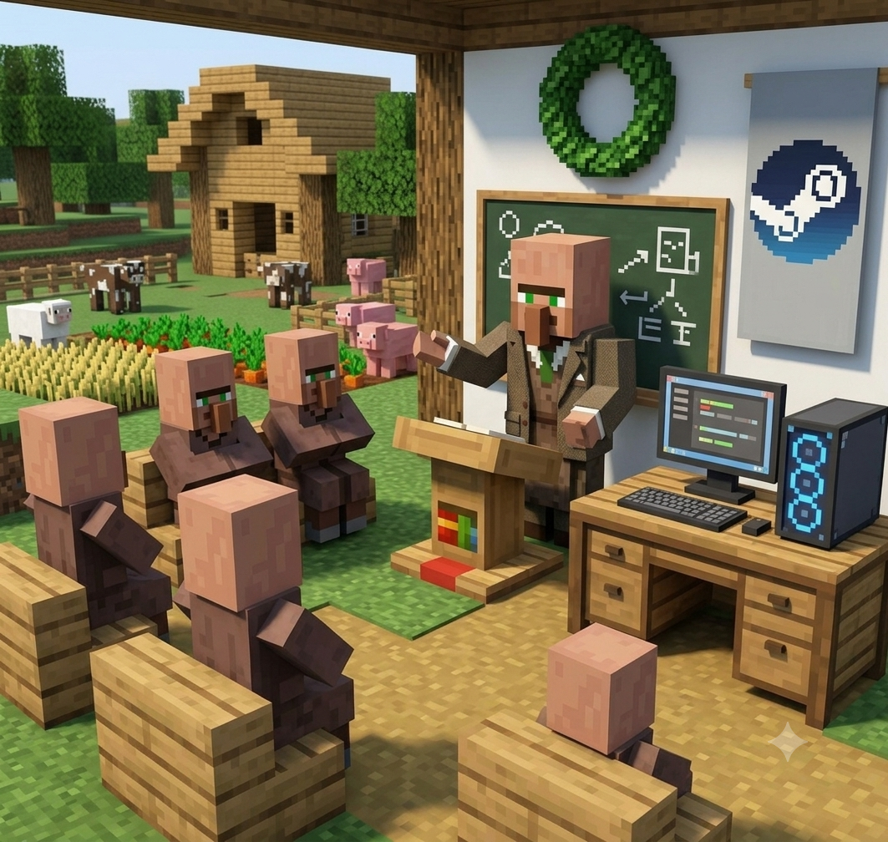

# Открой свою ферму под моим наставничеством

<figure><figcaption></figcaption></figure>

<h2 align="center">🔥 <mark style="color:green;">Запуск фермы CS2 с личным сопровождением</mark></h2>


Прочитал гайд, но всё равно не понимаешь с чего начать? Или начал, наступил на грабли и не хочешь наступать на них дальше? Тогда это для тебя.


#### Я не продаю «курс из десяти уроков» и не выдаю шаблонные отписки. Это индивидуальная работа: разбираем твою ситуацию, твой бюджет, твоё железо и запускаем ферму так, чтобы она не легла через две недели.

#### Общение не заканчивается на одном созвоне. Я остаюсь на связи, пока ферма не встанет на рельсы, и дальше тоже - потому что первая волна банов случится не в первый день, а вопросы у тебя появятся именно тогда.

***

<h2 align="center">📦 <mark style="color:green;">Что входит</mark></h2>

#### 🕯️ **Разбор всех вопросов.** Никаких «прочитай гайд». Отвечаю по каждой детали, пока не станет понятно, как это работает и почему именно так.

#### 🖥️ **Подбор железа.** Помогу собрать конфиг под твой объём и бюджет, без переплаты за мощности, которые тебе не понадобятся.

#### ⚙️ **Настройка панели.** Разберём панель от установки до автосбора дропа, чтобы ты управлял процессом, а не гадал, что там происходит.

#### ⌛ **Автоматизация подготовки аккаунтов.** Дам доступ к скриптам, которые снимают с тебя самую нудную часть работы.

#### 💲 **Личная скидка в магазине.** Отдельные цены на всё, что нужно для запуска.

#### 🛡️ **Разбор рисков.** Самое важное. Покажу, где именно теряют деньги и как построить ферму так, чтобы одна волна не забрала всё разом.

***

<h2 align="center">❓ <mark style="color:green;">Кому это НЕ подойдёт</mark></h2>


Скажу честно, чтобы не тратить время ни своё, ни твоё:

* Если ты ищешь схему без рисков - её нет, и я такую не продам.
* Если у тебя последние деньги и ты хочешь их удвоить - не надо, серьёзно.
* Если ты не готов вникать и хочешь, чтобы всё сделали за тебя - тебе нужен [отфарм](otfarm-akkauntov.md), а не наставничество.


<h3 align="center">Написать мне ➙ <a href="TGLink"><mark style="color:green;">TGLink</mark></a></h3>
