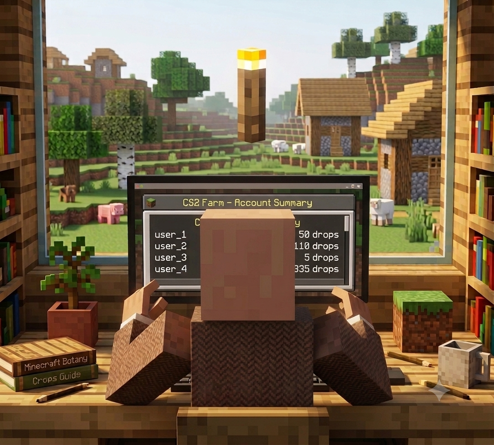

# Какую панель выбрать?


Сразу главное: **ни одна публичная панель не спасёт от банов.** Все заявления разработчиков про «безопасный фарм» - маркетинг. Безопасного фарма не существует. Выбирай по удобству и функционалу, а не по обещаниям.


<figure><figcaption></figcaption></figure>

<h2 align="center">💼 <mark style="color:green;">Чем пользуюсь я - DM Panel</mark></h2>

#### После нескольких пойманных волн я закрепился на [**DM Panel**](https://t.me/dmpanelsbot?start=6810487864) и до сих пор не жалею. Причины конкретные, без лирики:

### <mark style="color:blue;">1️⃣ Не нужно тратиться на второй уровень</mark>

#### Чтобы начать фармить, не надо докупать игры ради второго ранга. Это сразу минус расходы на каждом аккаунте, а на объёме разница получается серьёзная.

### <mark style="color:blue;">2️⃣ Хавает любые аккаунты</mark>

#### Нет проблем с поиском игр и капризов по поводу истории аккаунта. Для меня это критично, потому что аккаунты у меня приходят разные, и панель, которая половину из них не переваривает, мне не подходит.

### <mark style="color:blue;">3️⃣ Реализован глобальный поиск 2х2</mark>

#### Это, на мой взгляд, самое важное. Поиск идёт **между аккаунтами всех пользователей панели**, а не внутри твоей пачки. Я тестил лично - совместные игры находятся даже на аккаунтах с пёстрой историей.


Пока в этот режим особо никто не идёт - люди привыкли к DM, и это нормально. Но если с DM что-то пойдёт не так, народ перетечёт туда, комьюнити сформируется и режим оживёт. Я считаю, что за глобальным поиском будущее.


### <mark style="color:blue;">4️⃣ Техническая часть</mark>

#### Спуфер, который в последних обновлениях довели до ума. Это та часть, которую пользователь не видит, но которая решает.

<h2 align="center">🌟 <mark style="color:green;">Альтернативы</mark></h2>

* #### [**DM Panel**](https://t.me/dmpanelsbot?start=6810487864) - то, чем пользуюсь сам
* #### [**FSM Panel**](https://t.me/moonlighter_shop_bot?start=6810487864) - универсальное решение, много режимов
* #### [**Manager Standard**](https://t.me/standard_arb_bot?start=jjjyhhff) - использую для того чтобы управлять большим количеством своих акков, очень удобно

#### У каждой своя аудитория. Пробовать имеет смысл на маленькой партии аккаунтов, а не сразу на всей ферме.

***

<h2 align="center">☠️ <mark style="color:green;">Почему я считаю, что 2х2 «в ничью» мертво</mark></h2>

#### Логика на поверхности. Когда тысячи аккаунтов играют друг с другом и матчи стабильно заканчиваются одинаково - это паттерн, который видно невооружённым глазом. Рандомный счёт не спас. Два разных режима игры тоже не спасли.

#### Причём последние волны стали аккуратнее: раньше выкашивали под ноль, сейчас часть свежих аккаунтов вообще не трогают. Это не доброта - это точечная работа по паттернам. И чем очевиднее паттерн у твоей панели, тем выше шанс попасть.


Отсюда простой вывод: чем ближе поведение фермы к настоящему рандому, тем дольше она живёт. Панели, которые двигаются в сторону глобального поиска между реальными пользователями, в долгую выиграют у тех, кто крутит матчи внутри одной пачки.


<h2 align="center">✅ <mark style="color:green;">Итог: по каким критериям выбирать</mark></h2>

1. #### **Цена подписки** - и как она масштабируется на твой объём.
2. #### **Требования к аккаунтам** - нужен ли второй уровень, нужны ли платные игры.
3. #### **Режимы** - что панель умеет и не встанешь ли ты колом, если один режим прикроют.
4. #### **Автоматизация** - автосбор и автоотправка дропа обязательны, без них ты будешь жить в панели руками.
5. #### **Статистика** - без нормальных цифр ты не посчитаешь окупаемость.
6. #### **Поддержка** - насколько быстро отвечают, когда всё встало в воскресенье ночью.

#### **Фармишь ты чем хочешь.** Я пишу только про свой опыт - всё на твой страх и риск.
